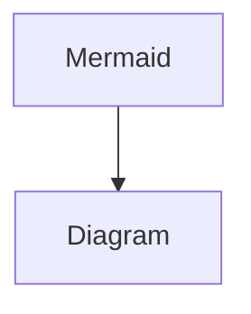

- [ ] Add Github Action

## Basic blocks

### Text

**All kinds** of **text** *styling* options are supported. Basic `text` blocks are akin to
HTML `<p>` tags. ==Text blocks== also support a **variety** of ~~**rich**~~ text formatting options.

### Quote

> This is an example quote.

### Callout

> [!note]- Here is callout block This is a basic callout. It can contain blocks and *rich text*. 💪

> [!tip] Like this one.

> [!question] Are callouts folable?

> [!warning] Note about lucide icons

> [!abstract] Abstract

> [!todo] Todo

> [!success] Success

> [!missing] Missing

> [!error] Errors

> [!bug] Bug

> [!example] Example

### Ordered list

1. Item 1.
2. Item 2.

### Unordered list

- Item 1.
- Item 2.

### To do list

- [ ] Task 1.
- [x] Task 2.

### Divider

---

## Integrations

### Images

![[PHP-FPM.png]]


### Video youtube


### Equations

$$
\begin{matrix}
E &=& mc^2 \\
a^2 + b^2 &=& c^2
\end{matrix}
$$

### Table

|          | Header 1 | Header 2 |
| -------- | -------- | -------- |
| Column 1 | Item     | Item     |
| Column 2 | Item     | Item     |

### Code

This is inline `code` and below are block code with highlighted. Note that, there is a copy button on the top-right
corner of the block of code.

```python showLineNumbers title="main.py" del={5} ins={4}
def sum_and_div(num1, num2):
  sum_nums = num1 + num2
  div_nums = num1 / num2
  return sum_nums, div_nums # multiple returns

sum, div = sum_and_div(18, 9)
print(sum, div)
```

### Mermaid



## Advanced blocks

> [!multi-column]
>
> > [!note]
> >
> > ```python
> > print(1)
> > ```
>
> > [!note]
> >
> > ```python
> > print(1)
> > ```

Or 3 columns (or 4 if you want),

> [!multi-column]
>
> > [!note] Code
> >
> > ```python
> > print(1)
> > ```
>
> > [!note] Code
> >
> > ```python
> > print(1)
> > ```
>
> > [!note] Code
> >
> > ```python
> > print(1)
> > ```

### Columns with different sizes

This one has a **greater length** than the other side. This sentence has no meaning; it's just for a temporary test.

```python
print(1)
```

This one has a **shorter length** than the other side. This sentence has no meaning; it's just for a temporary test.

### Nested blocks

Click to see the nested blocks Side by side code and figure

> [!multi-column]
>
> > [!note|wide-1] Code
> >
> > ```python
> > print(1)
> > ```
>
> > [!note|wide-2] Images
> > 

### Heading and its content can be toggled too

### Synced blocks

You also use synced block. Note that, the below sentence is a clone of this sentence. You also use synced block. Note
that, the below sentence is a clone of this sentence.

### Link to other page

You can use `[[]]` to link to other pages too, for example [[docker|Docker]]
